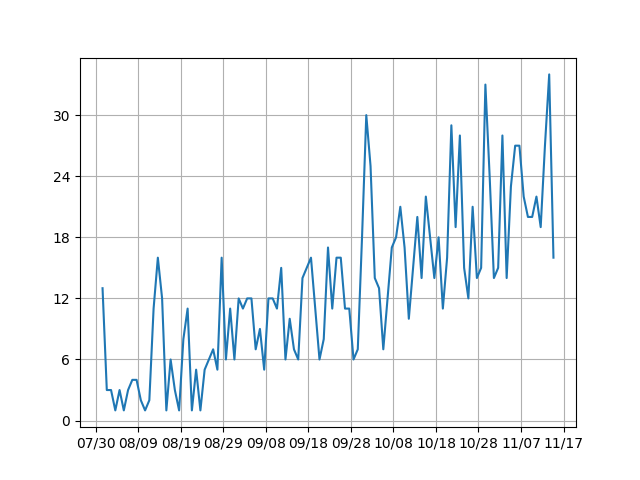
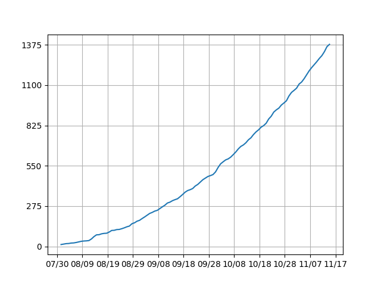
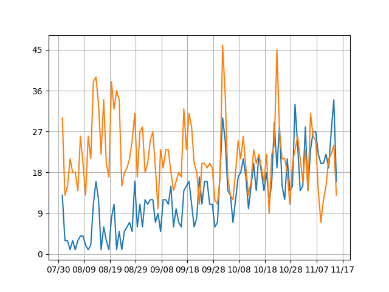

# VOICEVOX利用状況調査　ver1

## 前提条件
[スナップショット検索API v2](https://site.nicovideo.jp/search-api-docs/snapshot)を使用し、タイトル、説明文、タグのいずれかに「VOICEVOX」が含まれる動画を抽出し調査した。  
調査対象期間は2021/08/01-2021/11/15で、2021/11/17現在の状態に基づいている。

## 動画投稿数
日別の動画投稿数は以下の通りである。  
（以下の期間は動画投稿数が増えている可能性がある）  
- 第7回ひじき祭 (8/21-8/31)
- 第2回原石祭 (10/2-10/3)
- 第2回手抜き祭 (10/23-10/27)

___
総投稿数の推移は以下の通りである。

___
### 他サービスとの比較
タイトル、説明文、タグのいずれかに「CoeFont」が含まれる動画の数と比較した。  
（青：VOICEVOX 橙：CoeFont）

## 再生数
| 再生数 | 動画数 |
|:---|:---|
| ~100 | 281 |
| 100~500 | 573 |
| 500~1000 | 166 |
| 1000~5000 | 230 |
| 5000~10000 | 74 |
| 10000~ | 54 |

## 使用キャラクター
タイトルまたは説明文に、「めたん」「メタン」と入っていれば四国めたん、「ずんだもん」と入っていればすんだもんと判定した。
| キャラクター | 動画数 | 再生数 |
|:---:|:---|:---|
| ずんだもん | 652 | 2879378 |
| 四国めたん | 493 | 460921 |

## ジャンル
| ジャンル | 動画数 | 再生数 |
|:---|:---|:---|
| ゲーム | 846 | 2380378 |
| エンターテイメント | 276 | 975680 |
| 解説・講座 | 90 | 317047 |
| 旅行・アウトドア | 25 | 16734 |
| その他 | 23 | 70802 |
| 音楽・サウンド | 22 | 30563 |
| 技術・工作 | 21 | 111631 |
| null | 21 | 11156 |
| 料理 | 15 | 20915 |
| ラジオ | 14 | 9026 |
| アニメ | 7 | 5229 |
| 社会・政治・時事 | 7 | 3095 |
| 動物 | 4 | 42446 |
| 乗り物 | 3 | 1501 |
| 自然 | 2 | 5346 |
| ダンス | 1 | 766 |
| R-18 | 1 | 561 |

## タグ
VOICEVOX動画についているタグを集計し、上位20個を表示している。  
すべての結果は[tags.json（動画数）](tags.json)、[tags_view.json（再生数）](tags.json)にまとめている。
| タグ名 | 動画数 | <--> |　タグ名 | 再生数 |
|:---|:---|:---|:---|:---|
| ずんだもん | 581 | | ずんだもん | 2521372 | |
| voicevox実況プレイ | 445 | | ソフトウェアトーク実況プレイ | 1270421 |
| VOICEVOX | 394 | | VOICEROID実況プレイ | 1233491 |
| 四国めたん | 362 | | VOICEVOX | 970780 |
| ソフトウェアトーク実況プレイ | 214 | | among_us | 953003 |
| ずんだもん実況プレイ | 214 | | ふにんがす | 883880 |
| VOICEROID実況プレイ | 203 | | ずんだもん実況プレイ | 867007 |
| voicevox | 200 | | ゲーム | 809651 |
| ゲーム | 191 | | voicevox実況プレイ | 776999 |
| 四国めたん実況プレイ | 188 | | 東北きりたん | 716498 |
| VOICEVOX実況プレイ | 126 | | voicevox | 693479 |
| voiceroid実況プレイ | 110 | | ずん虐 | 616163 |
| 東北きりたん実況プレイ | 93 | | 四国めたん | 583920 |
| 東北きりたん | 75 | | VOICEVOX実況プレイ | 578967 |
| fallout4 | 73 | | VOICEROID劇場 | 460579 |
| ソフトウェアトーク劇場 | 58 |　| エンターテイメント | 455611 |
| 描いてみた | 58 | | 東北きりたん実況プレイ | 417988 |
| 実況プレイ動画 | 55 | | voiceroid劇場 | 398919 |
| VOICEROID劇場 | 53 |  | ソフトウェアトーク劇場 | 374890 |
| ソフトウェアトーク | 45 | | 小春六花実況プレイ | 359605 |

他の音声合成ソフト関連のタグのみを抜粋したものが以下である。  
(動画数5以下、~リンク系は省略)  
(+の右側は表記揺れ)
#### ソフトウェアトーク
| タグ名 | 動画数 | 再生数 |
|:---|:---|:---|
| ソフトウェアトーク実況プレイ | 214 | 1270421 |
| ソフトウェアトーク劇場 | 58 | 374890 |
| ソフトウェアトーク | 45 | 166982 |

#### VOICEROID系
| タグ名 | 動画数 | 再生数 |
|:---|:---|:---|
| VOICEROID実況プレイ | 203+110 | 1233491+347087 |
| VOICEROID劇場 | 53+35 | 460579+398919 |
| VOICEROID | 35+10 | 335428+130506 |
| #voiceroidクソダジャレ部 | 33+5 | 6435+634 |
| VOICEROID解説 | 28+13 | 307535+70416 |
| VOICEROIDキッチン | 9 | 11392+2060 |
| VOICEROID車載 | 7 | 6422+3279 |

#### CeVIO系
| タグ名 | 動画数 | 再生数 |
|:---|:---|:---|
| cevio実況プレイ | 41+11 | 317911+172122 |
| CeVIO | 7+11 | 43864+23747
| cevio解説 | 5+4 | 23899+10922 |

#### CoeFont系
| タグ名 | 動画数 | 再生数 |
|:---|:---|:---|
| coefont実況プレイ | 21 | 29670 |
| coefont | 5+3 | 16287 |

#### キャラ系
(+の右側は表記揺れ)
| タグ名 | 動画数 | 実況プレイ動画数 | 再生数 | 実況プレイ再生数 |
|:---|:---|:---|:---|:---|
| 東北きりたん | 75 | 93 | 716498 | 417988 |
| 東北ずん子 | 30 | 20 | 83354 | 144106 |
| 琴葉茜 | 17 | 12 | 127096 | 37749 |
| 結月ゆかり | 16 | 45 | 25748 | 222281 |
| 琴葉茜・葵 | 15+5 | 7 | 86457+53423 | 78129 |
| 小春六花 | 14 | 8 | 24147 | 359605 |
| 東北イタコ | 12 | 32 | 20998 | 73971 |
| さとうささら | 11+11 | 33 | 11394+30125 | 114172 |
| 琴葉葵 | 11 | 6 | 54121 | 74679 |
| 音街ウナ | 9 | 28 | 31075 | 15300 |
| 紲星あかり | 9 | 20 | 14702 | 22307 |
| すずきつづみ | 8 | 24 | 9719 | 71903 |
| 御手師マリー | 8 | 0 | 53417 | 0 |
| ついなちゃん | 7 | 7 | 23050 | 35202 |
| 弦巻マキ | 6+14 | 11 | 30404+53250 | 65501 |
| 月読アイ | 6 | 2 | 8455 | 4136 |
| 伊織弓鶴 | 6 | 0 | 2715 | 0 |
| 京町セイカ | 5 | 18 | 40190 | 249311 |
| タカハシ | 5 | 0 | 16104 | 0 |